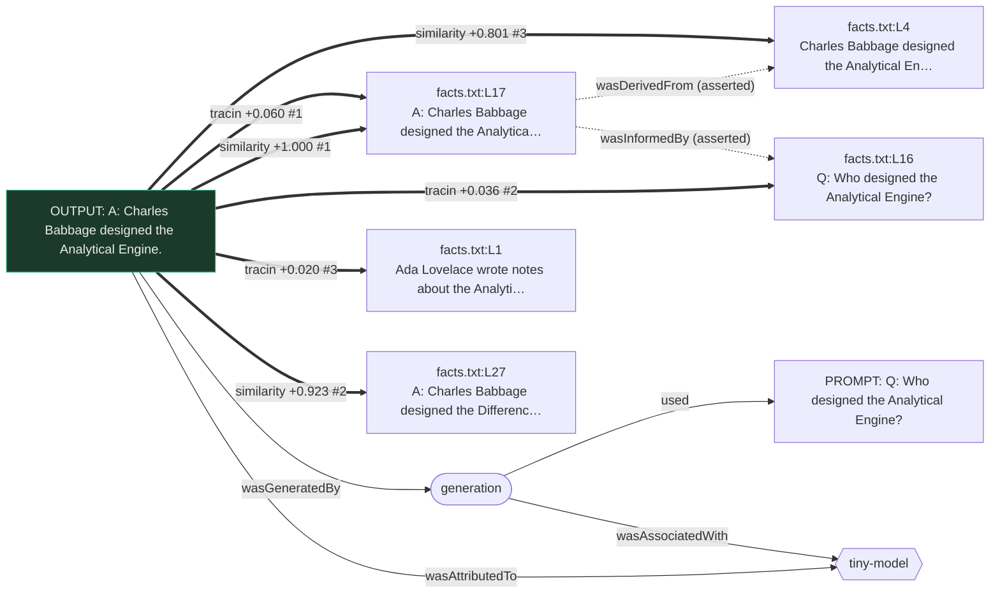

# tiny-provenance

**A tiny language model that shows you where its output came from — and shows you exactly where that gets hard.**

You hear it constantly: *tracing an LLM's output back to its training data is unsolvable.*
That's true at frontier scale, for reasons worth taking seriously. But "unsolvable at scale"
got flattened into "impossible," and that's not right. At **tiny** scale it is very much
solvable, and building it that way makes the real obstacle legible instead of hand-wavy.

This repo trains a ~38K-parameter transformer from scratch on three tiny text files, then
attributes every generated answer back to the specific training lines that produced it —
**three different ways, cheap to expensive** — and emits the result as a standard
[W3C PROV-O](https://www.w3.org/TR/prov-o/) provenance record you can render to a picture.

The point isn't the toy. The point is what the three methods *disagree* about. That
disagreement is the whole story of why attribution is hard, and you can run it in about a
minute.

---

## TL;DR

```bash
python3 -m venv .venv
source .venv/bin/activate
pip3 install -r requirements.txt

python3 build_model.py                                            # trains model.json + provenance.json (~15s)
python3 prompt_model.py "Q: Who designed the Analytical Engine?"  # instant: similarity + TracIn
python3 prompt_model.py "Q: Who designed the Analytical Engine?" --loo   # adds leave-one-out (~2 min)
```

The trained model is just a JSON file. So is the provenance model. Everything runs on CPU.
(In a later session, just `source .venv/bin/activate` again before running the scripts.)

---

## The three ways it attributes an output

| method | question it answers | needs the model? | cost | honest label |
|---|---|---|---|---|
| **similarity** | which source *looks* most like the output? | no | instant | **relatedness**, not provenance |
| **TracIn** | which source's training gradient pushed the weights toward this output? | yes | instant (uses saved checkpoints) | causal, approximate |
| **leave-one-out** | if we delete this source and retrain, how much does the output's probability drop? | yes | ~1 retrain per source | causal, gold standard |

These sit on a deliberate gradient from cheap-and-shallow to expensive-and-real. That
gradient **is** the article: the cheap method that everyone reaches for measures the wrong
thing, and the method that measures the right thing is the one that doesn't scale.

---

## What actually happens when you run it

Prompt: `Q: Who designed the Analytical Engine?`
Output: `A: Charles Babbage designed the Analytical Engine.`

| source | text | similarity | TracIn | leave-one-out |
|---|---|---|---|---|
| `facts.txt:L17` | A: Charles Babbage designed the Analytical Engine. | **#1** (+1.000) | **#1** (+0.060) | **#1** (+4.144) |
| `facts.txt:L27` | A: Charles Babbage designed the **Difference** Engine. | **#2** (+0.923) | #6 (+0.011) | ~0 (+0.037) |
| `facts.txt:L4` | Charles Babbage designed the Analytical Engine in the nineteenth century. | #3 (+0.801) | #45 (−0.004) | +0.004 |
| `facts.txt:L16` | Q: Who designed the Analytical Engine? | #5 (+0.654) | #2 (+0.037) | — |

Look at **`facts.txt:L27`**. Similarity ranks it **#2** — it's almost the same sentence
("Charles Babbage designed the … Engine"). But that line is about the *Difference* Engine;
it had essentially nothing to do with this answer. Both causal methods know that: TracIn
drops it to #6, and leave-one-out gives it **+0.037** (deleting it and retraining barely
moves the output) versus **+4.144** for the line the model actually leaned on.

That single row is the thesis. **Similarity is confident and wrong. Causal attribution is
right and expensive.**

### The same thing as a provenance graph

`prompt_model.py` writes a PROV-O record and renders it. Thick arrows are computed
attribution (with method + score); dashed arrows are the hand-authored relationships
between sources; plain arrows are the structural PROV backbone.



---

## The files

| file | what it is |
|---|---|
| `build_model.py` | **Script 1.** Trains the model, writes `model.json` and `provenance.json`. |
| `prompt_model.py` | **Script 2.** Prompt → generate → attribute (3 ways) → PROV-O + diagram. |
| `tiny_lm.py` | the model, tokenizer, training loop (shared by both scripts). |
| `prov_render.py` | standalone PROV-O **JSON-LD → Mermaid** converter (+ SVG via Graphviz). |
| `corpora/` | the three tiny training files: `facts.txt`, `dialogue.txt`, `micro_basic.txt`. |
| `outputs/` | generated `.jsonld` / `.provjson` / `.mmd` / `.svg` per prompt. |

`model.json` is the trained model (config + vocabulary + weights, ~40K numbers).
`provenance.json` is the "provenance model": every source line, the hand-authored
relationships between sources, the training checkpoints TracIn needs, and the raw corpus so
leave-one-out can retrain without a line.

---

## What's honest here, and what isn't

This is a research demo with its thumb nowhere near the scale. Being precise about that is
the point, not a disclaimer.

- **Similarity is relatedness, not provenance.** It's nearest-neighbour search in the
  model's own embedding space. The identical operation returns "matches" from *any* corpus,
  including one the model never trained on. Calling it provenance without an asterisk is the
  central mistake this whole repo is arguing against — so we label it *relatedness*.
- **The hand-authored relationships are asserted metadata, not discovered.** The
  answer→fact and line→line links (dashed edges) are heuristics `build_model.py` writes so
  the graph has structure. They are kept in a separate namespace and never mixed with the
  computed attribution. They are *editorial*, not model-derived.
- **Leave-one-out runs on a shortlist by default.** The cheap methods score all ~70
  sources; the expensive retrain runs only on the candidates they surface (plus asserted
  neighbours). Use `--loo-all` to retrain against every source (slower). This candidate-then-
  verify pattern is deliberate — it's how you'd do it at any real scale.
- **Overfitting is a feature.** The corpus is tiny and the model memorizes it. That's what
  makes attribution *meaningful* here: the model really is leaning on specific lines. At
  scale, generalization is exactly what smears attribution out.
- **PROV-O is the representation, not the mechanism.** PROV-O doesn't compute provenance; it
  *records* it. The hard, interesting work is the generation layer (the three methods). The
  PROV-O layer is the easy, already-standardized half — which is the point.

---

## Why this doesn't just scale up (the honest hard part)

Everything cheap here survives scale; everything that actually works here doesn't.

- **Similarity** scales fine — and stays wrong in the same way, just harder to notice.
- **TracIn** needs per-example gradients against saved checkpoints. Storable in principle,
  brutal in practice at billions of parameters, and the influence signal gets noisy.
- **Leave-one-out** means retraining the model once per source. Here that's ~70 retrains of a
  15-second model. At frontier scale it's ~one training run per candidate source, over a
  corpus of billions of documents. That's the wall — not a theoretical impossibility, a cost
  and a well-posedness problem (redundant sources each look "unnecessary" to leave-one-out
  even when they collectively carry the answer).

So the tiny model doesn't cheat the scaling problem. It makes it *concrete*: you can watch
the only trustworthy method be the one you can't afford, and watch the affordable method be
the one that's fooled by surface overlap.

---

## Rendering the PROV-O

- **Mermaid** (`.mmd`) renders inline on GitHub and at [mermaid.live](https://mermaid.live) —
  no tooling. `python3 prov_render.py outputs/<name>.jsonld` prints Mermaid for any PROV-O
  JSON-LD, not just ours.
- **SVG** (`.svg`) is produced automatically if the Graphviz `dot` binary is installed.
- **JSON-LD** (`.jsonld`) is standard RDF; load it into any PROV/RDF viewer (e.g. ProvVis at
  <https://openprovenance.org/vis/>). `.provjson` is the same record in PROV-JSON.

---

## Reproducibility

Fixed seeds throughout, greedy decoding, deterministic attribution. `python3 build_model.py`
then `python3 prompt_model.py "<prompt>"` gives the same numbers every time. Knobs:
`--epochs`, `--d-model`, `--n-head` on the builder; `--topk`, `--loo`, `--loo-all`,
`--loo-epochs` on the prompter.

---

## How this was built (in the open)

I didn't type this code, and I didn't write this README either. I built the whole thing by
directing an AI (Claude), the words you're reading included. That felt right for a repo about
tracing where things came from: a provenance tool ought to be honest about its own provenance.
So here are the actual prompts I used to build it, in order, followed by a plain account of
how it went, including the parts that broke.

### The prompts, verbatim

**1.** *(with an earlier web chat exploring the idea attached)*
> I had this discussion with Claude web chat about attribution. Can you use the AI chat history folder to look at the recent Be the Model discussion and also the recent FOO Camp discussion? This was a big topic in FOO Camp, and I might have told you about it there.
> What I really want to do is see if we can take that tiny model that I'm developing in Be the Model and create a prototype attribution where it reads when it trains the model on the extremely tiny corpus. It actually creates a separate provenance model. When we do a lookup to issue a prompt and run the attention and transformer to generate a response, it adds the provenance filter to generate likely provenance.
> Don't generate anything just yet. For now, just read those two chats and the attached markdown file and tell me if you think this is realistic.

**2.**
> sure, let's do both side by side. i've got plenty of usage to burn on this, and i'm honestly sick of hearing people tell me that this is an unsolvable problem. i would love to write a radar piece saying, yes, not only is it solvable, but i solved it on a tiny scale, here's a github repo with the solution that you can run right now, and here's the challenge we'll face when scaling up.
>
> do you think prov-o makes sense for actually generating the provenance? or is that overcomplicating things?

**3.**
> Yes, they should be able to just load the Pravo RDF straight into an online viewer, which I bet we can find. I'm fine serializing it as JSON-LD, and people will probably be happier with that than an RDF-tripled file, and it has the same information. I did just mean as the representation, not as anything in the generation part.
> I think the hard part is obviously building the actual generation layer. That just happens to emit prov-o. It could also emit text files or whatever. It doesn't really matter. I just like prov-o because it can generate a pretty image if we wanted to. And we can always generate a simple prov-o JSON-LD to Mermaid diagram converter if one doesn't already exist.

**4.**
> I'm totally fine with giving them a way to turn PROV-O into an image file, so it seems like you solved that problem just fine. So now it's just down to making sure we have a good starting point for running this little experiment in creating a tiny LLM that we can train on our tiny corpus and that actually generates PROV-O attribution. We need something to attribute it to. Maybe we should assume that each sentence or line in each text file in the training materials, which are very very small, is its own separate source. Maybe we can create a relationship between them, just to have some sort of dependency information in there, so we have something to render with PROV-O.
> The final result would be one script. I assume this is all going to be in Python, one Python script that creates the model, which I'm pretty sure will just be a giant, or maybe even not-so-giant, JSON file. We'll probably be creating it with PyTorch. Another script would actually let you issue a prompt against it. When you issue the prompt, it then takes the output. Our initial generation script will have generated a second file that is the provenance model, and when we run the prompt, it also does the provenance overlay by trying to do the provenance match filter that I discussed.
> Does this all make sense? If it does, repeat it back to me in simple terms so I make sure we're both on the same page, and once we are, then we'll be able to make a plan.

**5.**
> all of that looks right to me. do you have everything you need to generate the scripts that i can run?

**6.**
> that all looks great. green light.

**7.**
> for the commands -- i need to use pip3 and python3, and i want to use a venv

**8.**
> running prompt_model.py -> ModuleNotFoundError: No module named 'lxml'

**9.**
> the disk shouldn't be full
>
> ```
> (.venv) andrewstellman@Mac tiny-provenance % df -h .
> Filesystem      Size    Used   Avail Capacity iused ifree %iused  Mounted on
> /dev/disk3s5   3.6Ti   3.0Ti   677Gi    82%     10M  7.1G    0%   /System/Volumes/Data
> ```
>
> are you talking about your own mount?

### How it actually went

It started as a feasibility check, not code. I uploaded an earlier chat about attribution
and asked Claude to read it (plus my Be the Model and Foo Camp discussions) and tell me
whether the idea was realistic *before* generating anything. The useful pushback came right
away: what I'd first sketched was *similarity* attribution, which measures relatedness and
doesn't even need the model, while the honest, harder thing was *causal* attribution — and
that's exactly the thing that's uniquely doable at tiny scale. We decided to build both side
by side.

A couple of exchanges settled the representation: PROV-O as the container (not the thing that
computes attribution), serialized as JSON-LD, with a small custom PROV-to-Mermaid converter
because the usual online viewer (ProvStore) had gone offline. I specified the shape I wanted
— each corpus line as its own source with a few hand-authored relationships, two scripts (one
to build the model, one to prompt it and overlay provenance) — and gave it a green light.

The build itself was one continuous burst. Claude scaffolded the repo and wrote the four
scripts while PyTorch downloaded. The thesis showed up on the first real run: similarity
confidently blamed the look-alike *Difference* Engine line for an *Analytical* Engine answer,
and both causal methods correctly ignored it. One genuine engineering problem surfaced — a
full leave-one-out over every source would have taken more than half an hour — so leave-one-out
was changed to run on a candidate shortlist by default, with `--loo-all` for the complete
version.

Then three real fixes after delivery, which I'm including because a repo about honesty
shouldn't hide them:

1. I asked to switch everything to a `venv` with `python3`/`pip3`, which exposed an actual bug:
   `requirements.txt` used a `;` as if it were a comment, but `;` is a pip environment marker,
   so `pip3 install -r` would have failed.
2. Running `prompt_model.py` gave me `ModuleNotFoundError: No module named 'lxml'` — an
   undeclared transitive dependency of the `prov` library that happened to be preinstalled in
   the AI's sandbox, so it stayed invisible until I hit it on my own machine. Fixed by adding
   `lxml` to requirements.
3. While fixing that, the AI told me the disk was full. It wasn't — on my Mac. It was its own
   sandbox filling up as it reinstalled PyTorch, and I had to point out it was talking about
   its own mount, not my machine with 677 GB free.

None of that is polished, and that's the point. The interesting result — similarity is
confidently wrong, the causal methods are right and expensive — held up through all of it.

---

*Built as the runnable companion to a Radar piece on LLM attribution and provenance.*
*License: MIT (see [LICENSE](LICENSE)).*
